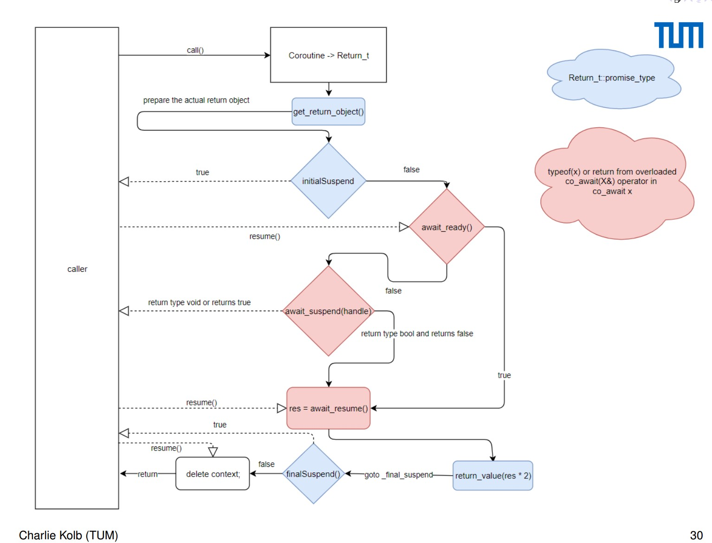

# Coroutine Playground

Random collections to understand coroutine (with minor or format tweaks)

---

[...](https://stackoverflow.com/a/70803344/4924135)

---

- Img from [Coroutines TS for C++2a](https://collab.dvb.bayern/download/attachments/63265333/Kolb%20-%20Coroutines%20in%20C%2B%2B20.pdf?version=1&modificationDate=1532345203997&api=v2)

---

## Notes

- Reference:
  - [C++20 Coroutines — Complete* Guide](https://itnext.io/c-20-coroutines-complete-guide-7c3fc08db89d)
- The support in C++20 is mainly targeted at library implementors

## Snippets

1. [Conceptual Coroutine](./src/conceptual_coroutine.hpp)
2. [Flow of calls](./src/flow_of_calls.hpp)
3. [Single thread task scheduler](./src/singlethread_scheduler.hpp)
4. [Multi thread task scheduler](./src/multithread_scheduler.hpp)
5. [Parse with generator](./src/parse_with_generator.hpp)
